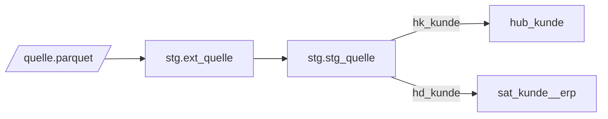

# Design-Dokumentation synchron halten (Model-First)

Dieses Projektschema arbeitet Model-First: Design in Mermaid → Review → Implementierung in dbt. Nach jeder Modell-Änderung müssen die Diagramme nachgezogen werden — ein ER-Diagramm, das nicht dem Code entspricht, ist schlimmer als keines, weil Reviews und Fachabstimmungen darauf vertrauen.

## Struktur

```
design/
├── staging/source_mapping.md        # Quelltabelle → Staging → Vault-Objekt Mapping
├── raw-vault/<concept>/
│   ├── overview.md                  # Hubs/Links/Sats mit BKs, offene Fragen
│   └── er-diagram.mmd               # Mermaid erDiagram des Konzepts
├── business-vault/                  # PITs, Bridges
└── data-flow/end_to_end.md          # Gesamtarchitektur (flowchart)
```

## Naming im Diagramm

- Entitätsnamen **lowercase**, exakt wie die dbt-Modelle: `hub_kunde`, `sat_kunde__erp`, `link_verkauf_kunde`
- Satellites immer mit `__<source>`-Suffix, Hubs/Links nie
- Relationslinien: `hub_kunde ||--o{ sat_kunde__erp : "has"`

## Mermaid-Muster

**ER-Diagramm** (Vault-Beziehungen, Datei `er-diagram.mmd`):

```mermaid
erDiagram
    hub_kunde {
        char64 hk_kunde PK
        string kundennr BK
    }
    sat_kunde__erp {
        char64 hk_kunde FK
        char64 hashdiff
        string name
    }
    hub_kunde ||--o{ sat_kunde__erp : "has"
    link_verkauf_kunde }o--|| hub_kunde : ""
```

**Datenfluss** (Staging, flowchart LR):



## Sync-Checkliste (nach jeder Modell-Änderung)

1. **Neues Vault-Objekt** → Entity-Block + Relationen in `er-diagram.mmd` des Konzepts ergänzen
2. **Jeder `sat_*`** hat eine Relation zu seinem Hub/Link; **jeder `link_*`** zu allen beteiligten Hubs
3. **Zähler/Übersicht** in `overview.md` aktualisieren (Objektlisten, offene Fragen abhaken)
4. **`source_mapping.md`**: neue Quelltabelle → Staging-View → Vault-Objekt Zeile eintragen
5. Konsistenz prüfen: Objekte in `models/raw_vault/**` ⇔ Einträge im Diagramm (beide Richtungen — der PostToolUse-Hook meldet Drift automatisch)

## Diagramm-Validierung

Mermaid-Syntax vor dem Abschluss prüfen (fehlende Klammern, falsche Relationship-Syntax sind die häufigsten Fehler). Wenn ein Mermaid-Renderer-Tool verfügbar ist, Diagramm rendern; sonst mindestens auf Klammer-Balance und `||--o{`-Syntax achten.
