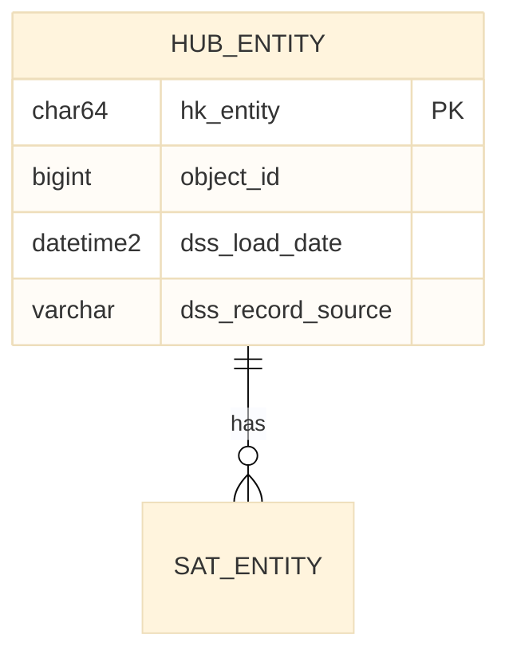

# Copilot Instructions - Data Vault 2.1 dbt Project

## Project Overview
Data Vault 2.1 on Azure SQL / SQL Server using dbt Core with the `automate_dv` package.

## Architecture Flow
```
Source System -> External Table (stg.ext_*) -> [PSA optional] -> Staging View (stg.stg_*) -> Hub/Sat/Link
```

## Schema Naming Convention

| Layer | Folder | Schema | Usage |
|-------|--------|--------|-------|
| Staging | `staging/` | `stg` | All sources |
| PSA (optional) | `staging/psa_*.sql` | `stg` | Persistent Staging Area (cache) |
| Raw Vault (common) | `raw_vault/_common/` | `vault` | Cross-source objects |
| Raw Vault (source) | `raw_vault/<concept>/` | `vault_<concept>` | Source-specific objects |
| Business Vault | `business_vault/` | `vault` | PITs, Bridges |
| Mart (common) | `mart/_common/` | `mart` | Shared dimensions |
| Mart (domain) | `mart/<concept>/` | `mart_<concept>` | Domain-specific views |

**Pattern:** `_common` -> base schema, `<concept>` -> `<base>_<concept>`

## PSA (Persistent Staging Area) Pattern
Use PSA when External Tables are large and repeatedly accessed. PSA caches data incrementally to avoid expensive OPENROWSET calls.

**Data Flow with PSA:**
```
ext_<concept>_<entity> (External Table)
    v
psa_<concept>_<entity> (Incremental dbt Table - merge/append)
    v
<concept>_<entity> (Staging View - Hash calculations) <- MUST reference PSA!
    v
Hub/Sat/Link (Raw Vault)
```

**Critical:** When a PSA exists, the Staging View must be updated to reference the PSA:
```sql
-- WITHOUT PSA (default)
SELECT * FROM {{ source('staging', 'ext_<concept>_<entity>') }}
-- WITH PSA (after PSA creation)
SELECT * FROM {{ ref('psa_<concept>_<entity>') }}```

**PSA sources.yml entry:**
```yaml
- name: <concept>_<entity>    # Without ext_ prefix
  meta:
    psa: true
    source_external_table: ext_<concept>_<entity>
```

## Critical Constraints (Azure SQL Basic Tier)
- **Always set** `as_columnstore: false` in incremental models
- **Never hardcode** database names - use `{{ target.database }}` in sources.yml
- **Authentication:** Azure CLI (`authentication: cli`) recommended - avoid passwords in profiles

## dbt Commands
```bash
source .venv/bin/activate
dbt run                              # Dev
dbt run --target prod                # Production
dbt run-operation stage_external_sources  # Create/update external tables
```

## Naming Conventions
| Object | Pattern | Example |
|--------|---------|---------|
| External Table | `stg.ext_<concept>_<entity>` | `stg.ext_adworks_kunde` |
| PSA Table | `stg.psa_<concept>_<entity>` | `stg.psa_adventureworks_saleslt_address` |
| Staging View | `stg.<concept>_<entity>` | `stg.adworks_kunde` |
| Hub | `vault_<concept>.hub_<entity>` | `vault_adworks.hub_kunde` |
| Satellite | `vault_<concept>.sat_<entity>` | `vault_adworks.sat_kunde` |
| Link | `vault_<concept>.link_<e1>_<e2>` | `vault_adworks.link_kunde_adresse` |
| DC Link | `vault_<concept>.link_<dc>_<parent>` | `vault_<concept>.link_contact_contractor` |
| DC Satellite | `vault_<concept>.sat_<dc>_<parent>_dc` | `vault_<concept>.sat_contact_contractor_dc` |
| Common Hub | `vault.hub_<entity>` | `vault.hub_company` (merged) |
| Hash Key | `hk_<entity>` | `hk_company` |
| Link Hash Key | `hk_link_<dc>_<parent>` | `hk_link_contact_contractor` |
| Hash Diff | `hd_<entity>` | `hd_company` |
| DC Hash Diff | `hd_<dc>_<parent>_dc` | `hd_contact_contractor_dc` |
| Metadata | `dss_*` prefix | `dss_load_date`, `dss_record_source` |
| Dimension (Common) | `mart.dim_<entity>` | `mart.dim_date` |
| Dimension (Domain) | `mart_<concept>.dim_<entity>` | `mart_<concept>.dim_<entity>` |
| Fact table (Common) | `mart.fakt_<entity>` | `mart.fakt_<entity>` |
| Fact table (Domain) | `mart_<concept>.fakt_<entity>` | `mart_<concept>.fakt_<entity>` |

## Dependent Child (DC) Pattern
Use DC when an entity has **no own stable Business Key** and is identified by parent relationship + DCK columns.

**Example: Contact as Dependent Child of Contractor**
```
hub_contractor -> link_contact_contractor -> sat_contact_contractor_dc
                 (HASH = FK + DCK)         (DCK: name, email1 in payload)
```

**Staging Requirements for DC:**
```sql
-- All hashes calculated in staging (automate_dv best practice)
hk_contractor                -- FK Hash to Parent Hub
hk_link_contact_contractor   -- Link Hash = HASH(company_contractor ^^ name ^^ email1)
hd_contact_contractor_dc     -- Hashdiff for change detection
```

**DC Link Model (Pure - only 1 FK):**
```yaml
src_pk: "hk_link_contact_contractor"
src_fk: "hk_contractor"  # Only parent FK, no second Hub
src_ldts: "dss_load_date"
src_source: "dss_record_source"
# NO src_payload for DC Links!
```

**DC Satellite Model:**
```yaml
src_pk: "hk_link_contact_contractor"  # References Link, not Hub
src_hashdiff:
  source_column: "hd_contact_contractor_dc"
  alias: "HASHDIFF"
src_payload:
  - "name"       # DCK Column
  - "email1"     # DCK Column
  - "phone"      # Additional attributes
```

## Multi-Active (MA) Satellite Pattern
Use MA Sat when an entity has **multiple concurrent valid values** (e.g., phone numbers, addresses, roles).

**Key Difference from DC Sat:** MA Sat hangs on **Hub** (not Link), uses `automate_dv.ma_sat` with `src_cdk`.

**Staging Requirements for MA:**
```sql
-- Hub hash key (same as standard)
hk_employee                  -- Hub Hash
-- MA-specific hashdiff (CDK + attributes)
hd_employee_ma               -- Hashdiff = HASH(phone_type || phone_number || is_primary)
```

**MA Satellite Model:**
```yaml
src_pk: "hk_employee"               # References Hub, not Link
src_cdk:                            # Child Dependent Keys (distinguishes records)
  - "phone_type"
src_hashdiff:
  source_column: "hd_employee_ma"
  alias: "HASHDIFF"
src_payload:
  - "phone_number"
  - "is_primary"
```

**DC vs MA Comparison:**
| Aspect | DC Satellite | MA Satellite |
|--------|--------------|--------------|
| Parent | Link | Hub |
| Macro | `automate_dv.sat` | `automate_dv.ma_sat` |
| Key Parameter | - | `src_cdk` |
| Use Case | Entity without own BK | Multiple values per entity |

## Hash Calculation (SQL Server Native)
Do NOT use automate_dv hash macros - they're incompatible with SQL Server. Use:
```sql
CONVERT(CHAR(64), HASHBYTES('SHA2_256', ISNULL(CAST(column AS NVARCHAR(MAX)), '')), 2)
```

## Adding a New Source System (Concept)
1. **Create folder:** `models/raw_vault/<concept>/hubs/`, `satellites/`, `links/`
2. **Add config to dbt_project.yml:**
   ```yaml
   raw_vault:
     <concept>:
       +schema: vault_<concept>
       +materialized: incremental
       +incremental_strategy: append
       +as_columnstore: false
   ```
3. **Create staging:** Add external table to `sources.yml`, create `<concept>_<entity>.sql`
4. **Create vault objects:** Hub, Satellite, Link in the new folder
5. **Deploy:** `dbt run-operation stage_external_sources && dbt run --select raw_vault.<concept>`

## Adding a New Entity (to existing concept)
1. **External Table:** Add to [sources.yml](models/staging/sources.yml) with full column definitions
2. **Staging View:** Create `models/staging/<concept>_<entity>.sql` with hash calculations
3. **Hub:** Create `models/raw_vault/<concept>/hubs/hub_<entity>.sql`
4. **Satellite:** Create `models/raw_vault/<concept>/satellites/sat_<entity>.sql`
5. **Schema YAML:** Document model in corresponding `_<layer>__models.yml` file (see below)
6. **Deploy:** `dbt run-operation stage_external_sources && dbt run --select +raw_vault.<concept>.hub_<entity> +raw_vault.<concept>.sat_<entity>`

## dbt Model Selection (IMPORTANT)

> **Always use full paths!** Model names like `hub_company` can exist in multiple concepts.

```bash
# Avoid - selects ALL hub_company across concepts
dbt run --select hub_company

# Recommended - specific path
dbt run --select raw_vault.<concept>.hub_company

# With upstream dependencies (builds staging automatically)
dbt run --select +raw_vault.<concept>.hub_company

# All models of one concept
dbt run --select raw_vault.<concept>
```

## Schema YAML Documentation (REQUIRED)

**Every model MUST be documented in a schema YAML file!**

### File Naming Convention
| Layer | File | Location |
|-------|------|----------|
| Staging | `_staging__models.yml` | `models/staging/` |
| Raw Vault | `_<concept>__models.yml` | `models/raw_vault/<concept>/` |
| Business Vault | `_business_vault__models.yml` | `models/business_vault/` |
| Mart | `_<concept>__models.yml` | `models/mart/<concept>/` |

### Template
```yaml
version: 2

models:
  - name: <model_name>
    description: Description of the model
    columns:
      - name: hk_<entity>
        description: Hash Key (Primary Key)
        data_type: char(64)
        tests:
          - not_null
          - unique
      - name: object_id
        description: Business Key
        data_type: bigint
        tests:
          - not_null
      - name: <attribute>
        description: Attribute description
        data_type: nvarchar(4000)
      - name: dss_load_date
        description: Load timestamp
        data_type: datetime2(7)
        tests:
          - not_null
      - name: dss_record_source
        description: Data source
        data_type: varchar(100)
        tests:
          - not_null
```

## Project Structure
```
models/
├── staging/                    -> stg
├── raw_vault/
│   ├── _common/                -> vault (cross-source)
│   │   ├── hubs/
│   │   ├── satellites/
│   │   └── links/
├── business_vault/             -> vault
└── mart/
    └── _common/                -> mart (shared dims)
```

## Key Files
- [dbt_project.yml](dbt_project.yml) - Model configs, schema assignments
- [models/staging/sources.yml](models/staging/sources.yml) - External table definitions (dbt-external-tables)
- [models/staging/_staging__models.yml](models/staging/_staging__models.yml) - Staging model documentation with columns
- [macros/generate_schema_name.sql](macros/generate_schema_name.sql) - Strips default schema prefix
- [docs/DEVELOPER.md](docs/DEVELOPER.md) - Full developer guide
- [docs/MODEL_ARCHITECTURE.md](docs/MODEL_ARCHITECTURE.md) - Data model documentation

## Common Pitfalls
- Schema creates as `dv_stg` instead of `stg` -> Check `generate_schema_name` macro
- External table errors -> Run `dbt run-operation stage_external_sources` first
- Cross-database error -> Replace hardcoded DB with `{{ target.database }}`- Object in wrong schema -> Check folder structure matches dbt_project.yml config

## Mermaid ER Diagrams

**After every model change, update the ER diagrams!**

| Model Folder | Diagram |
|---------------|----------|
| `models/raw_vault/_common/` | `design/raw-vault/_integrated/overview.md` |

### Format


### Rules
- **Theme:** `base` (neutral, no bright colors)
- **File extension:** `.mmd`
- **Attributes:** `type name [PK|FK]` (no comments after PK/FK)
- **Relationships:** simple labels, no quotes
