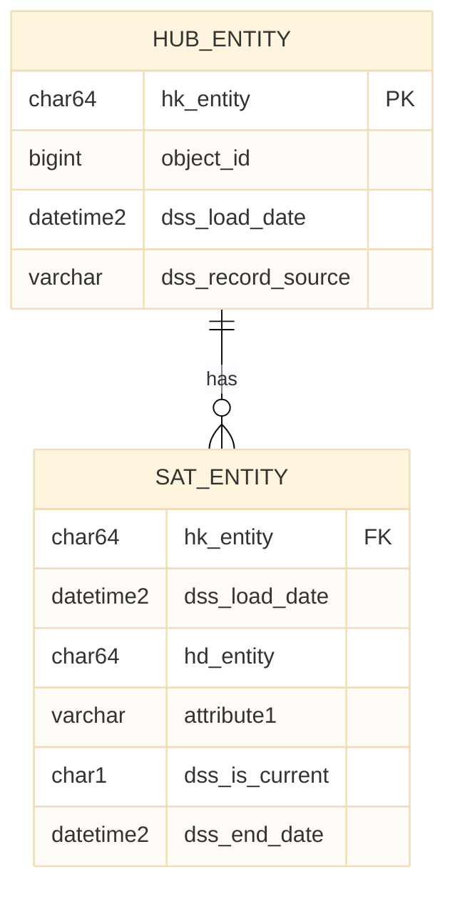

# Data Vault Design

> Model-First Approach: Zuerst Design in Mermaid, dann Implementierung in dbt

## ⚠️ WICHTIG: Diagramme aktuell halten

**Nach jeder Model-Änderung müssen die ER-Diagramme aktualisiert werden!**

```
models/raw_vault/<concept>/  →  design/raw-vault/<concept>/er-diagram.mmd
```

## Struktur

```
design/
├── staging/           # Quellsystem-Mapping & Staging Views
├── raw-vault/         # Hubs, Links, Satellites (ERD)
│   ├── _common/       # Übergreifende Objekte (Schema: vault)
│   ├── <concept>/     # Quellsystem-spezifisch (Schema: vault_<concept>)
│   │   ├── overview.md
│   │   └── er-diagram.mmd   ← Mermaid ER-Diagramm
│   └── adventureworks/
├── business-vault/    # PITs, Bridges, berechnete Satellites
└── data-flow/         # End-to-End Datenfluss
```

## Schema-Konvention

| Schema | Verwendung | Beispiel |
|--------|------------|----------|
| `stg` | Staging Views | `stg.stg_company` |
| `vault` | Integrierte/übergreifende Objekte | `vault.hub_company` (merged) |
| `vault_<concept>` | Quellsystem-spezifisch | `vault_<concept>.hub_project` |
| `mart_<concept>` | Business-Domain Marts | `mart_project.company_current_v` |

## Workflow

1. **Design** → Mermaid-Diagramm erstellen/aktualisieren
2. **Review** → Diagramm mit Fachbereich abstimmen
3. **Implement** → dbt Model basierend auf Design erstellen
4. **Update** → ER-Diagramm nach Implementation aktualisieren
5. **Validate** → Sicherstellen, dass Implementation dem Design entspricht

## Mermaid ER-Diagramme

### Dateiformat
- **Dateiendung:** `.mmd` (Mermaid)
- **Speicherort:** `design/raw-vault/<concept>/er-diagram.mmd`
- **Theme:** `base` (neutral, keine bunten Farben)

### Template


### Themes
| Theme | Beschreibung |
|-------|-------------|
| `base` | Minimalistisch, neutral (empfohlen) |
| `neutral` | Grautöne |
| `default` | Bunt, Standard-Farben |
| `dark` | Dunkler Hintergrund |
| `forest` | Grüntöne |

### Relationship Syntax
```
||--o{  : One-to-Many (Hub → Satellite)
||--||  : One-to-One
}|--|{  : Many-to-Many
||--o|  : One-to-Zero-or-One
```

## Diagramm-Typen

| Schicht | Diagramm-Typ | Zweck |
|---------|--------------|-------|
| Staging | `flowchart` | Quell-zu-Staging Mapping |
| Raw Vault | `erDiagram` | Entity-Relationship (Hubs, Links, Sats) |
| Business Vault | `erDiagram` | PITs, Bridges, berechnete Felder |
| Data Flow | `flowchart` | End-to-End Lineage |

### Namenskonventionen
- Hub: `hub_<entity>`
- Link: `link_<entity1>_<entity2>`
- Satellite: `sat_<entity>`
- Effectivity Satellite: `eff_sat_<link>`
- PIT: `pit_<entity>`
- Bridge: `bridge_<entity1>_<entity2>`
