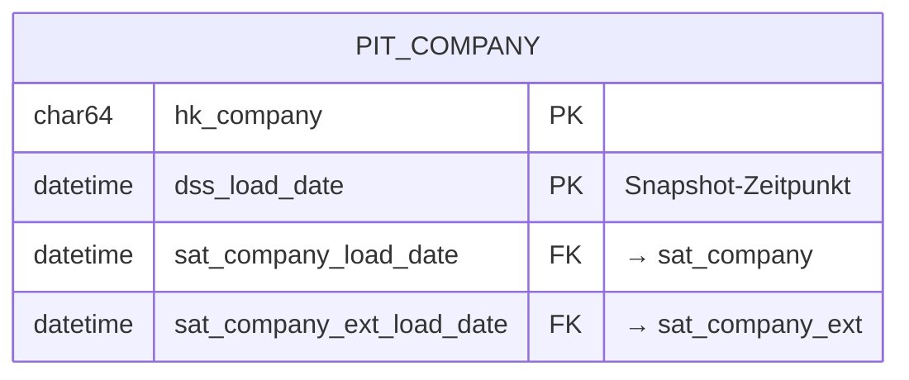
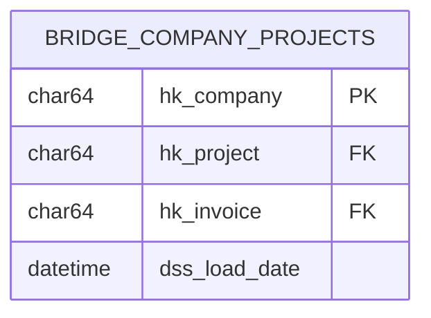

# Business Vault Design

Point-in-Time Tables (PITs), Bridges und berechnete Satellites.

## Dateien

| Datei | Beschreibung |
|-------|--------------|
| `overview.md` | Gesamtübersicht Business Vault |
| `pit_<entity>.md` | Point-in-Time Table Design |
| `bridge_<entities>.md` | Bridge Table Design |

## Konzepte

### Point-in-Time (PIT) Tables

PITs vereinfachen den Zugriff auf historische Daten durch Vorberechnung der Satellite-Versionen zu jedem Zeitpunkt.

### Bridge Tables

Bridges denormalisieren Link-Strukturen für performante Abfragen.

## Templates

Siehe:
- [_template_pit.md](_template_pit.md)
- [_template_bridge.md](_template_bridge.md)
