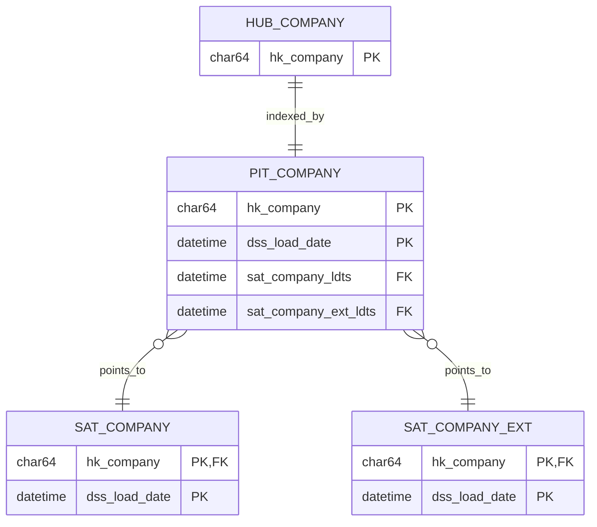
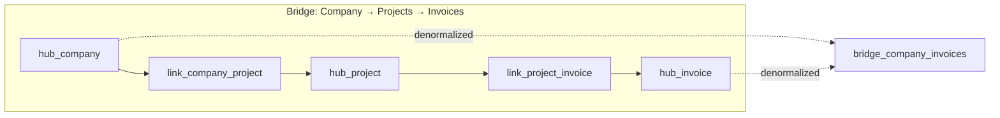

# Business Vault - Gesamtübersicht

## Entity-Relationship Diagramm

## Implementierungsstatus

| Objekt | Status | dbt Model | Beschreibung |
|--------|--------|-----------|--------------|
| `pit_company` | ✅ | `models/business_vault/pit_company.sql` | PIT für Company |
| `bridge_company_projects` | ⏳ | - | Geplant |

## Geplante Erweiterungen

### Bridges

### Berechnete Satellites

- `sat_company_calculated` - KPIs wie Umsatz, Anzahl Projekte
- `sat_customer_calculated` - Customer Lifetime Value
