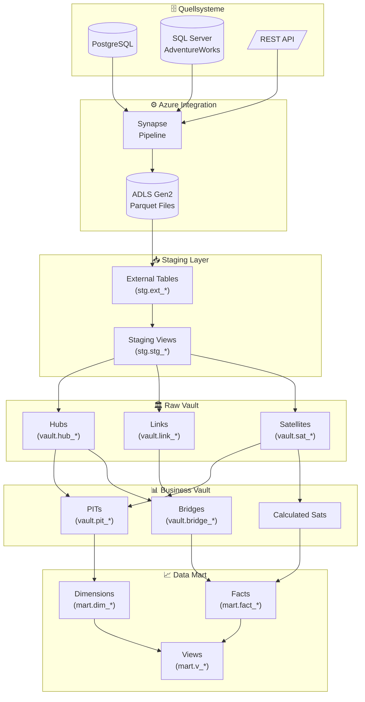
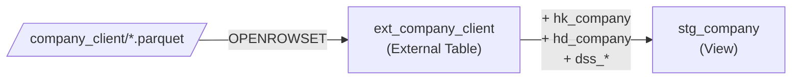
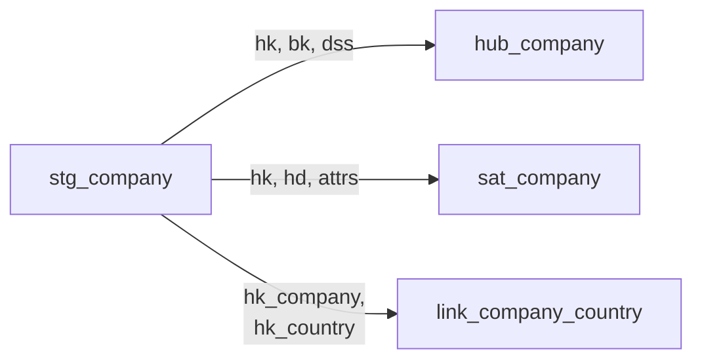
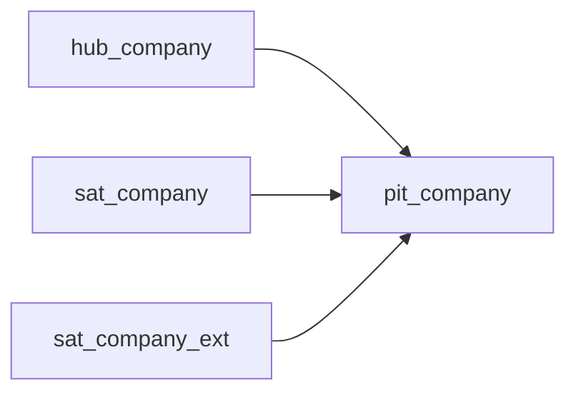
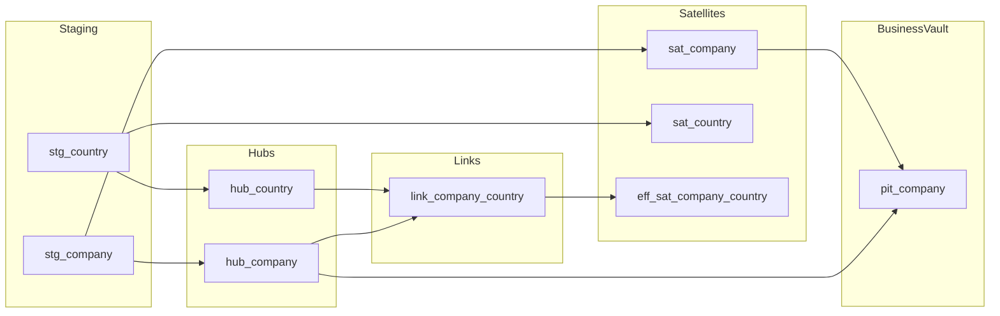

# End-to-End Datenfluss

## Gesamtarchitektur

## Schicht-Details

### 1. Quellsysteme → ADLS

| Quelle | Pipeline | Ziel-Pfad | Frequenz |
|--------|----------|-----------|----------|
| `<source_system>.company_client` | `pl_<source_system>` | `/raw/<source_system>/company_client/` | Daily |
| `<source_system>.countries` | `pl_<source_system>` | `/raw/<source_system>/countries/` | Daily |
| AdventureWorks.Customer | pl_adventureworks | `/raw/aw/customer/` | Daily |

### 2. ADLS → Staging

### 3. Staging → Raw Vault

### 4. Raw Vault → Business Vault

## dbt DAG (vereinfacht)

