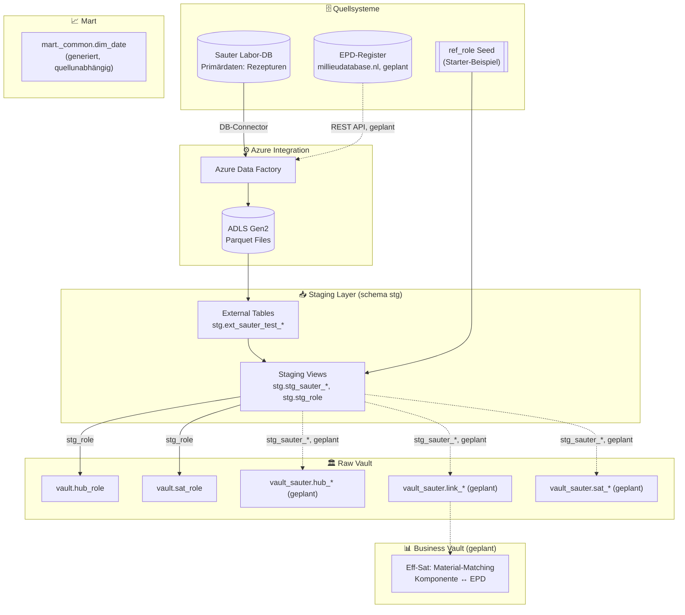
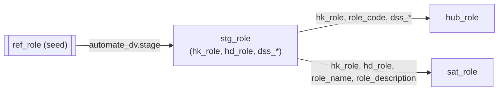
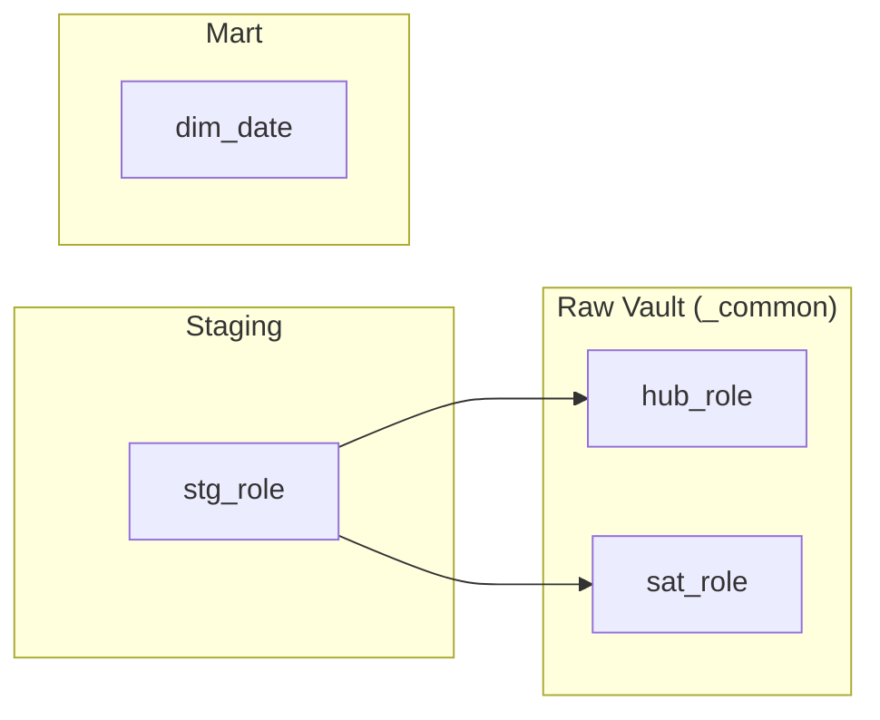

# End-to-End Datenfluss

## Gesamtarchitektur

## Schicht-Details

### 1. Quellsysteme → ADLS

| Quelle | Ziel-Pfad | Status |
|--------|-----------|--------|
| Sauter Labor-DB | `sauter-test/*.parquet` | ✅ angebunden (267 External Tables) |
| EPD-Register (millieudatabase.nl) | `epd/*.parquet` | ⏳ geplant (Phase 2) |

Details: [design/staging/source_mapping.md](../staging/source_mapping.md)

### 2. Staging → Raw Vault (implementiert: Starter-Beispiel)

### 3. Staging → Raw Vault (geplant: Sauter)

Siehe [design/raw-vault/sauter/er-diagram.mmd](../raw-vault/sauter/er-diagram.mmd) für das vollständige Zielmodell (Hubs `hub_werk`, `hub_rezept`, `hub_rezeptbasis`, `hub_komponente`, `hub_lieferantenwerk`; Links inkl. `link_rezept_komponente` mit `sat_stoffraum` als Mengenbasis für `GWP_m³ = Σ (Mengeᵢ × GWPᵢ)`).

## dbt DAG (aktueller Stand)

`dim_date` ist eine generierte, quellunabhängige Datumsdimension (2020–2035) ohne Upstream-Abhängigkeit im DAG.
