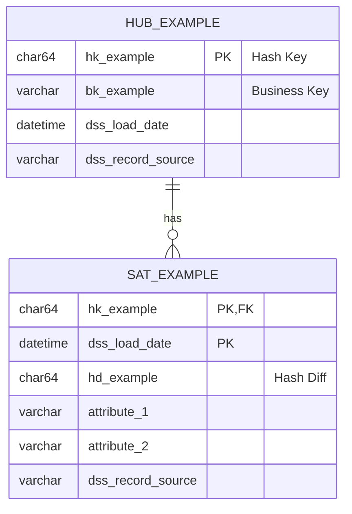

# Raw Vault Design

Entity-Relationship Diagramme für Hubs, Links und Satellites.

## Dateien

| Datei | Beschreibung |
|-------|--------------|
| `overview.md` | Gesamtübersicht Raw Vault |
| `hub_<entity>.md` | Hub mit zugehörigen Satellites |
| `link_<entities>.md` | Link mit Effectivity Satellites |

## Legende

## Templates

Siehe:
- [_template_hub.md](_template_hub.md)
- [_template_link.md](_template_link.md)
