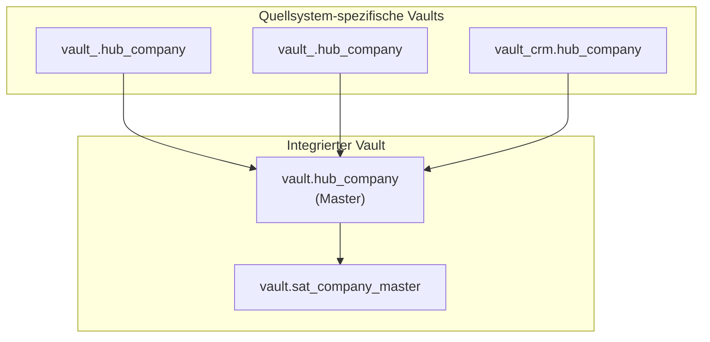

# Raw Vault Design - Integrated

> Schema: `vault`

Übergreifende Data Vault Objekte die aus mehreren Quellsystemen zusammengeführt werden.

## Konzept

## Wann hier?

Ein Objekt gehört in `vault` (integriert) wenn:

1. **Mehrere Quellen** - Entity existiert in mehreren Quellsystemen
2. **Master-Referenz** - Dient als zentrale Referenz für andere Systeme
3. **Cross-System Links** - Link verbindet Entities aus verschiedenen Quellsystemen

## Beispiele

| Objekt | Grund |
|--------|-------|
| `hub_company` | Company existiert in mehreren Quellsystemen (z.B. ERP, CRM) |
| `link_company_customer` | Verbindet Company aus Quellsystem A mit CRM-Customer |
| `sat_company_golden` | Golden Record aus mehreren Quellen |

## Aktuell implementiert

*Noch keine integrierten Objekte - alle Objekte sind aktuell quellsystem-spezifisch.*
