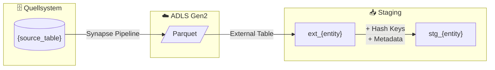

# Staging: {entity_name}

## Quellsystem

- **System:** {source_system}
- **Schema:** {schema}
- **Tabelle:** {table}
- **Ladefrequenz:** {daily/hourly/realtime}

## Datenfluss



## Spalten-Mapping

| Quellspalte | Ziel-Spalte | Transformation | Kommentar |
|-------------|-------------|----------------|-----------|
| `id` | `{entity}_id` | - | Business Key |
| `name` | `{entity}_name` | `TRIM()` | |
| - | `hk_{entity}` | `SHA2_256(id)` | Hash Key |
| - | `hd_{entity}` | `SHA2_256(name,...)` | Hash Diff |
| - | `dss_load_date` | `GETDATE()` | Metadata |
| - | `dss_record_source` | `'{source}'` | Metadata |

## Business Keys

```sql
-- Hash Key Berechnung
CONVERT(CHAR(64), HASHBYTES('SHA2_256', 
    ISNULL(CAST(id AS NVARCHAR(MAX)), '')
), 2) AS hk_{entity}
```

## Datenqualität

- [ ] NOT NULL Check auf Business Key
- [ ] Duplikat-Check auf Business Key
- [ ] Referentielle Integrität zu {related_entity}
