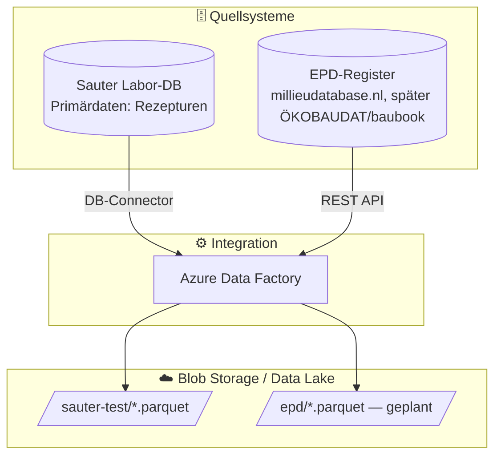

# Source System Mapping

## Übersicht Quellsysteme

## Quellsystem: Sauter (Landing Zone `sauter-test/`)

**267 External Tables** angebunden (`stg.ext_sauter_test_*`, siehe `models/staging/sources.yml`). Modelliert wird zunächst nur der operative Kernpfad ([docs/QUELLSYSTEM_SAUTER.md](../../docs/QUELLSYSTEM_SAUTER.md), validiert: [docs/ER_VALIDIERUNG_SAUTER.md](../../docs/ER_VALIDIERUNG_SAUTER.md)):

| Quelltabelle (ext_sauter_test_*) | Staging View | Vault-Objekt |
|----------------------------------|--------------|--------------|
| `stamm_firma_werke` | `stg_sauter_werk` | `hub_werk`, `sat_werk` |
| `kommunikation_extrezeptbasis` | `stg_sauter_rezeptbasis` | `hub_rezeptbasis`, `sat_rezeptbasis` |
| `annahme_basis` | `stg_sauter_annahme` | `hub_rezept`, `link_rezeptbasis_rezept` |
| `stoffraum_komponenten` | `stg_sauter_stoffraum` | `link_rezept_komponente`, `sat_stoffraum` |
| `kompo_zuschlag_firma` | `stg_sauter_kompo_zuschlag` | `hub_komponente` (Multi-Source), `sat_komponente_zuschlag`, `link_komponente_lieferantenwerk` |
| `kompo_bindemittel_firma` | `stg_sauter_kompo_bindemittel` | dito, `sat_komponente_bindemittel` |
| `kompo_zusatzmittel_firma` | `stg_sauter_kompo_zusatzmittel` | dito, `sat_komponente_zusatzmittel` |
| `kompo_wasser_firma` | `stg_sauter_kompo_wasser` | dito, `sat_komponente_wasser` |
| `kompo_fueller_firma` | `stg_sauter_kompo_fueller` | dito, `sat_komponente_fueller` |
| `kompo_preise` | `stg_sauter_kompo_preise` | `link_werk_komponente_preis`, `sat_preis` |
| `stamm_lieferantenwerk` | `stg_sauter_lieferantenwerk` | `hub_lieferantenwerk`, `sat_lieferantenwerk` |
| `stamm_zuschlagarten` u. a. `stamm_*arten` | `stg_sauter_ref_*` | `ref_*arten` (Views) |

Peripherie (bewusst noch nicht modelliert): `import_lieferscheine` (+ `_chargen`, `_dosierungen` — für spätere Ist-Bilanzierung), `kompo_komponentenverbund`, `kompo_farbe/fasern/zusatzstoff_firma` (KOMPOTYP-Klärung offen).

## Quellsystem: EPD (geplant, Phase 2)

| Quelltabelle | Staging View | Vault-Objekt |
|--------------|--------------|--------------|
| millieudatabase.nl Export | `stg_epd_nmd_material` | `hub_epd_material`, `sat_epd_material__nmd` |

Material-Matching (Business Vault) erzeugt `link_komponente_epd` + Eff-Sat.

## Starter-Beispiel (implementiert, kein Quellsystem)

| Quelle | Staging View | Vault-Objekt |
|--------|--------------|--------------|
| `ref_role` (Seed) | `stg_role` | `hub_role`, `sat_role` |

Beweist die Pipeline `stg → hub → sat` end-to-end (Hash-/Hashdiff-Berechnung via `automate_dv.stage()`), unabhängig von Sauter/EPD.
