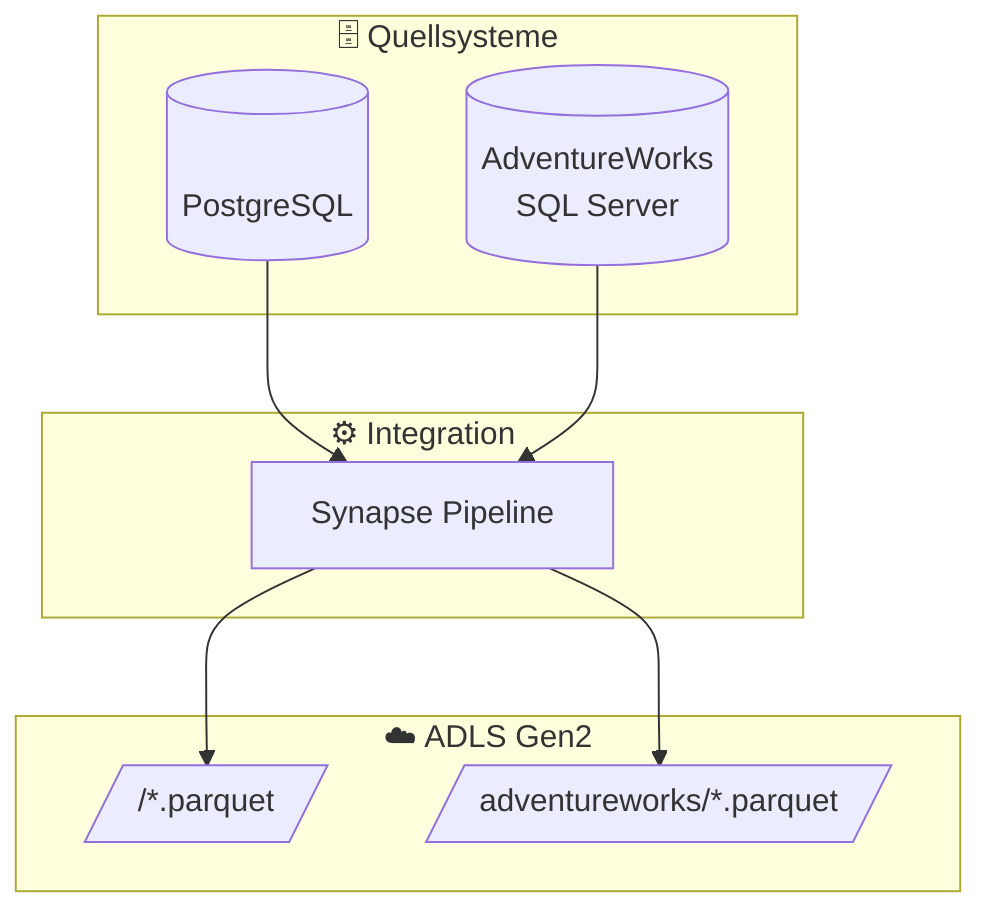

# Source System Mapping

## Übersicht Quellsysteme

## Quellsystem: `<source_system>` (PostgreSQL)

| Quelltabelle | Staging View | Hub | Satellite |
|--------------|--------------|-----|-----------|
| `company_client` | `stg_company` | `hub_company` | `sat_company` |
| `countries` | `stg_country` | `hub_country` | `sat_country` |
| `project` | `stg_project` | `hub_project` | `sat_project` |
| `invoice` | `stg_invoice` | `hub_invoice` | `sat_invoice` |

## Quellsystem: AdventureWorks

| Quelltabelle | Staging View | Hub | Satellite |
|--------------|--------------|-----|-----------|
| `Customer` | `stg_aw_customer` | `hub_customer` | `sat_customer` |
