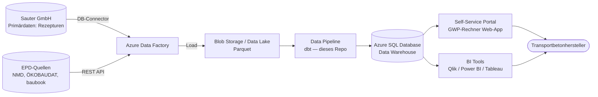

# BMI – Architektur 2.0 (Kurzfassung)

> Quelle: „BMI - Architektur 2.0 — Systemkontext und Makro-Architektur", DI Bernhard Prem (PPMC Analytics), Stand 02.07.2026. Arbeitsfähige Kurzfassung für die Entwicklung in diesem Repo.

## Projektziel

PPMC Analytics entwickelt gemeinsam mit der Sauter GmbH einen **GWP-Rechner für die Transportbetonbranche**: ein rechts- und normkonformes Tool für den europäischen Markt zur Bewertung der Treibhausgasemissionen von Transportbeton. Fachlicher Partner ist die niederländische Firma **ASCEM**; erste Sekundärdatenquelle ist **millieudatabase.nl**.

## Stakeholder

| Wer | Rolle |
|-----|-------|
| PPMC Analytics | Projektleitung, Architektur, Datenmodell |
| Sauter GmbH | Operativer Partner, Primärdatenlieferant (Rezepturen) |
| ASCEM | Fachlicher Ansprechpartner Transportbeton & Ökobilanz |
| Transportbetonhersteller | Endkunden / Nutzer des GWP-Rechners |
| EPD-Register | Sekundärdatenlieferanten (GWP-Werte) |

## Systemkontext & Makro-Architektur

Bausteine: Frontend/Self-Service-Portal · Backend/Berechnungs-Engine · **Datalakehouse nach Data Vault 2.0 (dieses Repo)** · Integrationslayer zu Sauter und EPD-Quellen.

## Datenlayer

- **Raw Vault:** Rohdaten aller Quellen, unverändert und historisiert
- **Business Vault:** bereinigte, angereicherte, integrierte Modelle (u. a. Material-Matching)
- **Information Marts:** fachliche Sichten für Reporting und GWP-Rechner

## Datenmanagement

- **Primärdaten:** Sauter-Rezepturen & Chargendaten, Energieverbrauch der Betonwerke, Transportdistanzen. Primärdaten haben in der Berechnung **Vorrang** vor Sekundärdaten.
- **Sekundärdaten:** millieudatabase.nl zuerst; Erweiterung auf ÖKOBAUDAT, baubook, nationale EPD-Register. Anforderungen: normkonform, europäische/nationale Abdeckung, Aktualität, Provenance.

## Komponenten

| Komponente | Aufgabe |
|-----------|---------|
| **EPD-Adapter** | Connector millieudatabase.nl; erweiterbar für ÖKOBAUDAT/baubook; Mapping EPD-Datensätze → Materialklassen |
| **Material-Matching** | Zuordnung Sauter-Rohstoffe ↔ EPD-Einträge; regelbasiert mit Qualitätsprüfung; Unsicherheiten dokumentieren |
| **GWP-Kalkulations-Engine** | Module A1–A3 je 1 m³ Transportbeton; Aggregation Material- & Prozessemissionen; dokumentierte Ersatzwerte bei fehlenden Sekundärdaten |
| **Compliance-/Validierungsmodul** | Normkonforme Prüfung; Auditlogs, Versionierung, Datenherkunft; Reporting von Annahmen & Datenqualität |

## Berechnungsmethode

**Grundformel:** `GWP_m³ = Σᵢ (Mengeᵢ × GWPᵢ)` — Mengeᵢ = Materialanteil je m³ Beton, GWPᵢ = spezifischer Treibhausgaswert des Materials.

**Lebenszyklusmodule:** A1 Rohstoffgewinnung/Herstellung · A2 Transport zur Mischanlage · A3 Herstellung des Betons. (Optional später A4–A5.)

**Qualitätskontrolle:** Prüfung der funktionalen Einheit, Plausibilitätsprüfung der Materialmengen, versionierte Speicherung, transparente Dokumentation aller Annahmen.

## Normen & rechtliche Anforderungen

- **ISO 14067** — Treibhausgasbilanz von Produkten
- **EN 15804 / EN 15978** — Umweltdeklarationen für Bauprodukte / Bewertung Gebäude
- **ISO 21930** — Umweltproduktdeklarationen für Gebäude
- **Branchen-PCR für Transportbeton** (2024)
- **EU-Taxonomie** (Verordnung (EU) 2020/852)

Anforderungen an den GWP-Rechner: klare funktionale Einheit, dokumentierte Systemgrenze (A1–A3, optional A4–A5), Priorisierung von Primärdaten, transparente Datenherkunft, Plausibilitäts-/Validierungslogik.

## Projektphasen

1. **Fachliche Abstimmung** — Workshops mit ASCEM, PCR-Anforderungen, initialer Datenumfang
2. **Prototyp** — PoC, Anbindung millieudatabase.nl, erste Berechnungen typischer Rezepturen
3. **Erweiterung** — weitere EPD-Quellen, Ausbau DV-Modelle, weitere Länder
4. **Betrieb & Go-to-market** — Normkonformitäts-Doku, Schulungen, Bereitstellung
