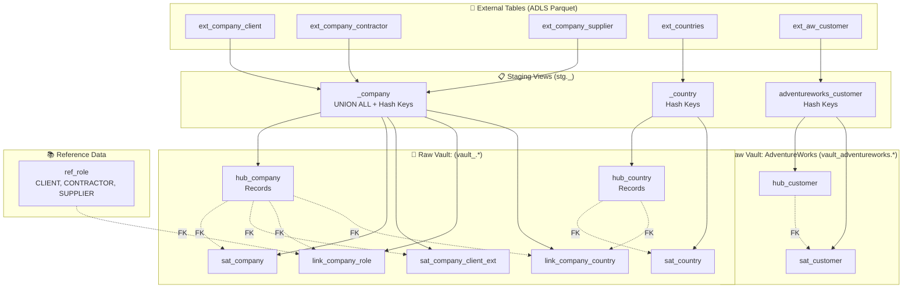
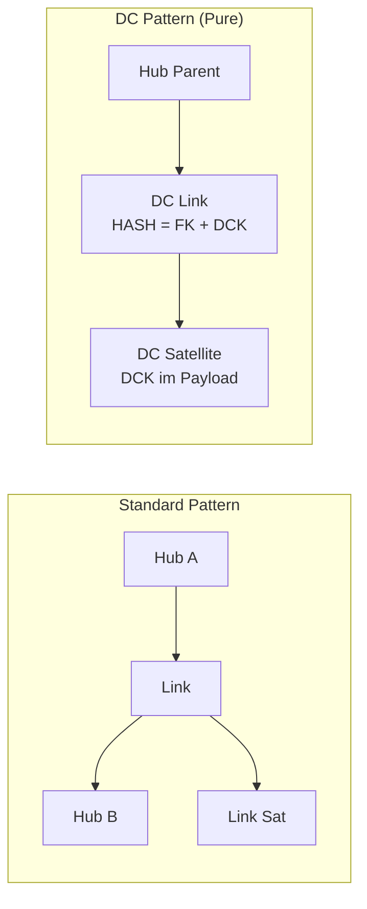
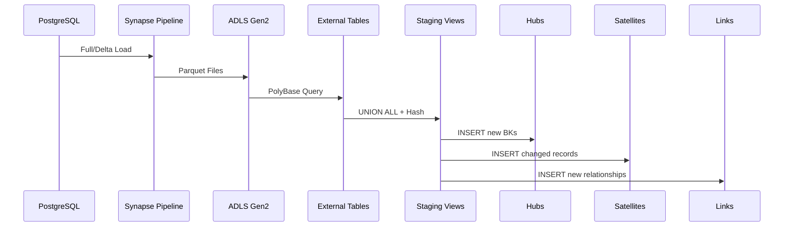
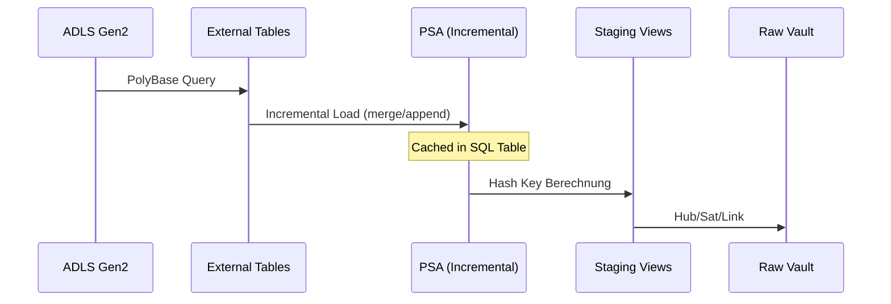

# Data Vault 2.1 - Model Architecture

## Schema-Naming-Konvention

| Layer | Ordner | Schema | Verwendung |
|-------|--------|--------|------------|
| Staging | `staging/` | `stg` | Alle Quellen |
| PSA (optional) | `staging/psa_*.sql` | `stg` | Persistent Staging Area (Cache für External Tables) |
| Raw Vault (common) | `raw_vault/_common/` | `vault` | Quell-übergreifende Objekte |
| Raw Vault (source) | `raw_vault/<concept>/` | `vault_<concept>` | Quellsystem-spezifische Objekte |
| Business Vault | `business_vault/` | `vault` | PITs, Bridges |
| Mart (common) | `mart/_common/` | `mart` | Geteilte Dimensionen |
| Mart (domain) | `mart/<concept>/` | `mart_<concept>` | Domain-spezifische Views |

**Pattern:** `_common` → Basis-Schema, `<concept>` → `<basis>_<concept>`

> **PSA (Persistent Staging Area):** Optionaler Cache-Layer für große External Tables. Reduziert OPENROWSET-Aufrufe durch inkrementelle Materialisierung. Staging Views referenzieren dann die PSA statt der External Table. Siehe [DEVELOPER.md](DEVELOPER.md#65-psa-persistent-staging-area-erstellen) für Details.

## Übersicht



## Entity Relationship Diagram

```mermaid
erDiagram
    %% <concept> Entities
    hub_company ||--o{ sat_company : "has attributes"
    hub_company ||--o| sat_company_client_ext : "has client attributes"
    hub_company ||--o{ link_company_role : "has roles"
    hub_company ||--o{ link_company_country : "located in"
    
    hub_country ||--o{ sat_country : "has attributes"
    hub_country ||--o{ link_company_country : "contains"
    
    ref_role ||--o{ link_company_role : "defines"

    %% AdventureWorks Entities
    hub_customer ||--o{ sat_customer : "has attributes"

    %% Dependent Child Pattern (Contractor → Contact)
    hub_contractor ||--o{ sat_contractor : "has attributes"
    hub_contractor ||--o{ link_contact_contractor : "has contacts"
    link_contact_contractor ||--o{ sat_contact_contractor_dc : "has DC attributes"

    hub_company {
        char64 hk_company PK "SHA256(object_id + source_table)"
        bigint object_id "Business Key"
        varchar source_table "Herkunftstabelle (z.B. client/contractor/supplier)"
        datetime2 dss_load_date
        varchar dss_record_source
        ___ ___ "Schema: vault_<concept>"
    }

    hub_contractor {
        char64 hk_contractor PK "SHA256(company_contractor)"
        bigint company_contractor "Business Key"
        datetime2 dss_load_date
        varchar dss_record_source
        ___ ___ "Schema: vault_<concept>"
    }

    hub_country {
        char64 hk_country PK "SHA256(object_id)"
        bigint object_id "Business Key"
        datetime2 dss_load_date
        varchar dss_record_source
        ___ ___ "Schema: vault_<concept>"
    }

    hub_customer {
        char64 hk_customer PK "SHA256(CustomerID)"
        int CustomerID "Business Key"
        datetime2 dss_load_date
        varchar dss_record_source
        ___ ___ "Schema: vault_adventureworks"
    }

    sat_company {
        char64 hk_company FK
        char64 hd_company "Hash Diff"
        varchar name
        varchar street
        varchar city
        varchar email
        varchar phone
        varchar iban
        datetime2 dss_load_date
    }

    sat_company_client_ext {
        char64 hk_company FK
        char64 hd_company_client_ext "Hash Diff"
        datetime2 freistellungsbescheinigung
        datetime2 dss_load_date
    }

    sat_country {
        char64 hk_country FK
        char64 hd_country "Hash Diff"
        varchar name
        datetime2 dss_load_date
    }

    link_company_role {
        char64 hk_link_company_role PK
        char64 hk_company FK
        char64 hk_role FK
        varchar role_code
        datetime2 dss_load_date
    }

    link_company_country {
        char64 hk_link_company_country PK
        char64 hk_company FK
        char64 hk_country FK
        datetime2 dss_load_date
    }

    ref_role {
        varchar role_code PK
        varchar role_name
        varchar role_description
    }

    sat_contractor {
        char64 hk_contractor FK
        char64 hd_contractor "Hash Diff"
        varchar name
        varchar short_name
        varchar email
        varchar phone
        varchar city
        datetime2 dss_load_date
        ___ ___ "Schema: vault_<concept>"
    }

    link_contact_contractor {
        char64 hk_link_contact_contractor PK "HASH(company_contractor + name + email1)"
        char64 hk_contractor FK
        datetime2 dss_load_date
        varchar dss_record_source
        ___ ___ "Pure DC Link - nur 1 FK"
    }

    sat_contact_contractor_dc {
        char64 hk_link_contact_contractor FK "Referenziert Link, nicht Hub"
        char64 hd_contact_contractor_dc "Hash Diff"
        varchar name "DCK"
        varchar email1 "DCK"
        varchar phone
        varchar function
        datetime2 dss_load_date
        ___ ___ "DC Satellite - DCK im Payload"
    }
```



## Dependent Child Pattern

Das **Dependent Child (DC)** Pattern wird verwendet für Entities ohne eigenen stabilen Business Key:



**Beispiel: Contact als Dependent Child von Contractor**

| Objekt | PK | FK | Beschreibung |
|--------|----|----|--------------|
| `hub_contractor` | `hk_contractor` | - | Parent Hub |
| `link_contact_contractor` | `hk_link = HASH(company_contractor, name, email1)` | `hk_contractor` | Pure DC Link (nur 1 FK) |
| `sat_contact_contractor_dc` | - | `hk_link_contact_contractor` | DCK (name, email1) im Payload |

```

## Datenfluss

### Standard-Datenfluss (ohne PSA)



### Datenfluss mit PSA (Persistent Staging Area)

Bei großen Datenmengen wird eine PSA-Tabelle zwischengeschaltet, um OPENROWSET-Aufrufe zu minimieren:



**PSA-Konfiguration:**
- `materialized='incremental'` - Inkrementell laden
- `incremental_strategy='merge'` - Upsert (oder `append` für Insert-only)
- `unique_key='<business_key>'` - Für Merge-Strategie erforderlich

**Referenzierung in Staging View:**
```sql
-- OHNE PSA (Standard)
SELECT * FROM {{ source('staging', 'ext_<concept>_<entity>') }}

-- MIT PSA (nach PSA-Erstellung)
SELECT * FROM {{ ref('psa_<concept>_<entity>') }}
```

## Datenzählung

| Objekt | Records | Beschreibung |
|--------|---------|--------------|
| `hub_company` | 22.457 | 7.501 Client + 7.610 Contractor + 7.346 Supplier |
| `hub_country` | 242 | Alle Länder |
| `sat_company` | 22.457 | Attribute aller Unternehmen |
| `sat_company_client_ext` | ~ | Nur Clients mit freistellungsbescheinigung |
| `sat_country` | 242 | Länder-Attribute |
| `link_company_role` | 22.457 | Verknüpfung Company↔Role |
| `link_company_country` | ~ | Verknüpfung Company↔Country |
| `ref_role` | 3 | CLIENT, CONTRACTOR, SUPPLIER |

## Hash Key Berechnung

Hashing erfolgt zentral über **automate_dv** mit den Projekt-Overrides in `macros/hash_override.sql` (`sqlserver__cast_binary` → hex-encoded `CHAR(64)`, `sqlserver__type_string` → `NVARCHAR` für Unicode). Separator und NULL-Behandlung kommen aus `dbt_project.yml` (`concat_string: '||'`, `null_placeholder_string: '-1'`, `hash_content_casing: DISABLED`).

```yaml
# In der Staging View (automate_dv.stage):
hashed_columns:
  hk_company:                 # Composite Key (object_id nicht global unique)
    - "object_id"
    - "source_table"
  hk_country: "object_id"     # Simple Key
```

Erzeugtes SQL-Muster: `CONVERT(CHAR(64), HASHBYTES('SHA2_256', …), 2)` — hex-encoded, lesbar, Index-freundlich. Der Berechnungsweg darf innerhalb einer Entity nie gemischt werden (manuell berechnete Hashes sind nicht kompatibel).

## DV 2.1 Compliance Features

### Ghost Records (Platzhalter für fehlende Daten)
```sql
-- Zero Key: Für unbekannte Business Keys (NULL)
{{ zero_key() }}  -- Ergibt: 0000000000000000000000000000000000000000000000000000000000000000

-- Error Key: Für fehlerhafte Daten
{{ error_key() }}  -- Ergibt: FFFFFFFFFFFFFFFFFFFFFFFFFFFFFFFFFFFFFFFFFFFFFFFFFFFFFFFFFFFFFFFF
```

### Current Flag & End-Dating
Alle Satellites haben:
- `dss_is_current` (CHAR(1)): 'Y' = aktueller Stand, 'N' = historisch
- `dss_end_date` (DATETIME2): Wann dieser Stand abgelöst wurde

### PIT-Tabelle (Point-in-Time)
`pit_company` ermöglicht effiziente Zeitreise-Abfragen:
```sql
SELECT * FROM vault.pit_company
WHERE snapshot_date = '2024-06-01'
```

### Effectivity Satellite
`eff_sat_company_country` trackt Gültigkeitszeiträume von Beziehungen:
- `dss_start_date`: Beginn der Beziehung
- `dss_end_date`: Ende der Beziehung (NULL = noch aktiv)
- `dss_is_active`: 'Y' = aktiv, 'N' = beendet
