# Phase 2: Implementierungsplan - AdventureWorks Raw Vault

## 🎯 Ziel dieser Phase

Einen **systematischen, fehlerfreien Implementierungsplan** erstellen, der:
- ✅ Abhängigkeiten berücksichtigt (Bottom-Up)
- ✅ Testbarkeit gewährleistet (nach jedem Schritt validieren)
- ✅ Schrittweise Komplexität aufbaut (Lernen durch Tun)
- ✅ Wiederholt lauffähig ist (Idempotenz)

---

## 📊 Abhängigkeiten-Graph

```mermaid
flowchart TB
    subgraph Phase1["🔵 Phase 1: Staging Layer"]
        ext[External Tables<br/>ext_adventureworks_*]
        stg_customer[stg_adventureworks_customer<br/>+ Hash Keys]
        stg_address[stg_adventureworks_address<br/>+ Hash Keys]
        stg_product[stg_adventureworks_product<br/>+ Hash Keys]
        stg_category[stg_adventureworks_productcategory<br/>+ Hash Keys]
        stg_salesorder[stg_adventureworks_salesorder<br/>+ Hash Keys]
        stg_orderdetail[stg_adventureworks_orderdetail<br/>+ Hash Keys]
        stg_customeraddress[stg_adventureworks_customeraddress<br/>+ Hash Keys]
    end

    subgraph Phase2["🟢 Phase 2: Hubs"]
        hub_customer[hub_customer]
        hub_address[hub_address]
        hub_product[hub_product]
        hub_category[hub_productcategory]
        hub_order[hub_salesorder]
    end

    subgraph Phase3["🟡 Phase 3: Satellites"]
        sat_customer[sat_customer]
        sat_customer_contact[sat_customer_contact]
        sat_address[sat_address]
        sat_product[sat_product<br/>inkl. ProductModelID]
        sat_product_pricing[sat_product_pricing]
        sat_product_desc[sat_product_description_ma<br/>Multi-Active: Culture]
        sat_category[sat_productcategory]
        sat_order[sat_salesorder]
    end

    subgraph Phase4["🟠 Phase 4: Links"]
        link_cust_addr[link_customer_address]
        link_order_cust[link_salesorder_customer]
        link_order_ship[link_salesorder_address_ship]
        link_order_bill[link_salesorder_address_bill]
        link_prod_cat[link_product_category]
        link_cat_parent[link_productcategory_parent]
    end

    subgraph Phase5["🔴 Phase 5: Link Satellites & DC"]
        lsat_cust_addr[lsat_customer_address<br/>AddressType]
        link_orderdetail[link_salesorderdetail]
        sat_orderdetail_dc[sat_salesorderdetail_dc]
    end

    %% Dependencies
    ext --> stg_customer
    ext --> stg_address
    ext --> stg_product
    ext --> stg_category
    ext --> stg_salesorder
    ext --> stg_orderdetail
    ext --> stg_customeraddress

    stg_customer --> hub_customer
    stg_address --> hub_address
    stg_product --> hub_product
    stg_category --> hub_category
    stg_salesorder --> hub_order

    hub_customer --> sat_customer
    hub_customer --> sat_customer_contact
    hub_address --> sat_address
    hub_product --> sat_product
    hub_product --> sat_product_pricing
    hub_product --> sat_product_desc
    hub_category --> sat_category
    hub_order --> sat_order

    hub_customer --> link_cust_addr
    hub_address --> link_cust_addr
    hub_order --> link_order_cust
    hub_customer --> link_order_cust
    hub_order --> link_order_ship
    hub_address --> link_order_ship
    hub_order --> link_order_bill
    hub_address --> link_order_bill
    hub_product --> link_prod_cat
    hub_category --> link_prod_cat
    hub_category --> link_cat_parent

    link_cust_addr --> lsat_cust_addr
    hub_order --> link_orderdetail
    hub_product --> link_orderdetail
    link_orderdetail --> sat_orderdetail_dc
```



---

## 🗓️ Implementierungs-Reihenfolge

### Sprint 1: Foundation (Hubs) - **Start hier!** 🎯

| Step | Objekt | dbt Folder | Abhängigkeiten | Validierung |
|------|--------|-----------|----------------|-------------|
| 1.1 | External Tables | - | ADLS Parquet | `dbt run-operation stage_external_sources` |
| 1.2 | `stg_adventureworks_customer` | `models/staging/` | ext_adventureworks_saleslt_customer | Hash-Berechnung prüfen |
| 1.3 | `hub_customer` | `models/raw_vault/adventureworks/hubs/` | stg_adventureworks_customer | Row Count = distinct CustomerID |
| 1.4 | `stg_adventureworks_address` | `models/staging/` | ext_adventureworks_saleslt_address | - |
| 1.5 | `hub_address` | `models/raw_vault/adventureworks/hubs/` | stg_adventureworks_address | - |
| 1.6 | `stg_adventureworks_product` | `models/staging/` | ext_adventureworks_saleslt_product | - |
| 1.7 | `hub_product` | `models/raw_vault/adventureworks/hubs/` | stg_adventureworks_product | - |

**🎯 Lernziel:** Hub-Pattern verstehen, Hash-Keys validieren

**✅ Success Criteria:**
- Alle Hubs laufen durch: `dbt run --select raw_vault.adventureworks.hubs`
- Keine Duplikate: `SELECT hk_*, COUNT(*) FROM hub_* GROUP BY hk_* HAVING COUNT(*) > 1`
- Business Keys erhalten: `SELECT COUNT(DISTINCT CustomerID) FROM hub_customer`

---

### Sprint 2: Attribute (Satellites)

| Step | Objekt | Abhängigkeiten | Notes |
|------|--------|----------------|-------|
| 2.1 | `sat_customer` | hub_customer | Stammdaten (Name, NameStyle, Title) |
| 2.2 | `sat_customer_contact` | hub_customer | Kontaktdaten (Email, Phone) |
| 2.3 | `sat_customer_company` | hub_customer | CompanyName, SalesPerson |
| 2.4 | `sat_address` | hub_address | Alle Address-Attribute |
| 2.5 | `sat_product` | hub_product | **Inkl. ProductModelID, ProductModelName** |
| 2.6 | `sat_product_pricing` | hub_product | StandardCost, ListPrice |
| 2.7 | `sat_product_description_ma` | hub_product | **Multi-Active**: CDK = Culture |

**🎯 Lernziel:** Satellite-Historisierung, Multi-Active Pattern

**✅ Success Criteria:**
- Hash Diff funktioniert: Nur Änderungen werden eingefügt
- Current Flag: Nur 1 Record pro Hub Key mit `dss_is_current = 'Y'`
- Multi-Active: Mehrere Descriptions pro Product gleichzeitig (verschiedene Cultures)

---

### Sprint 3: Beziehungen (Links)

| Step | Objekt | Abhängigkeiten | Notes |
|------|--------|----------------|-------|
| 3.1 | `link_customer_address` | hub_customer, hub_address | M:N Beziehung |
| 3.2 | `link_salesorder_customer` | hub_salesorder, hub_customer | Order → Customer |
| 3.3 | `link_salesorder_address_ship` | hub_salesorder, hub_address | Shipping Address |
| 3.4 | `link_salesorder_address_bill` | hub_salesorder, hub_address | Billing Address |
| 3.5 | `link_product_category` | hub_product, hub_productcategory | Product → Category |

**🎯 Lernziel:** Link-Pattern, Composite Hash Keys

**✅ Success Criteria:**
- Link Hash = HASH(FK1 + FK2): Keine Duplikate
- Referentielle Integrität: Alle FKs existieren in Hubs

---

### Sprint 4: Advanced Patterns

| Step | Objekt | Pattern | Notes |
|------|--------|---------|-------|
| 4.1 | `link_productcategory_parent` | Same-As Link | Hierarchie: Parent-Child |
| 4.2 | `lsat_customer_address` | Link Satellite | AddressType (Main, Shipping) |
| 4.3 | `link_salesorderdetail` | Transaction Link | Order → Product |
| 4.4 | `sat_salesorderdetail_dc` | Dependent Child | Line Items (kein eigener Hub) |

**🎯 Lernziel:** Same-As Links, Dependent Children, Transaction Links

---

## 📋 Detaillierter Schritt 1: Staging Layer

### Was muss ins Staging?

**Für jeden Hub:**
- ✅ Business Key(s)
- ✅ Hash Key: `hk_<entity> = SHA2(Business Key)`
- ✅ `dss_record_source`
- ✅ `dss_load_date`

**Für jeden Satellite:**
- ✅ Alle Attribute (für Hash Diff)
- ✅ Hash Diff: `hd_<entity> = SHA2(ALL attributes)`

**Für jeden Link:**
- ✅ Alle beteiligten Hash Keys (hk_customer, hk_address)
- ✅ Link Hash Key: `hk_link_* = SHA2(hk_1 || hk_2 || ...)`

**Für Multi-Active:**
- ✅ CDK (Child Dependent Key) = Culture
- ✅ Hash Diff inkl. CDK

---

## 🛠️ Praktische Umsetzung in dbt

### Folder-Struktur

```
models/
├── staging/
│   ├── sources.yml                           # External Tables
│   ├── _staging__models.yml                  # Documentation
│   ├── adventureworks_customer.sql           # Hash-Berechnung
│   ├── adventureworks_address.sql
│   ├── adventureworks_product.sql
│   └── ...
│
├── raw_vault/
│   └── adventureworks/
│       ├── _adventureworks__models.yml       # Documentation
│       ├── hubs/
│       │   ├── hub_customer.sql              # automate_dv.hub()
│       │   ├── hub_address.sql
│       │   └── hub_product.sql
│       ├── satellites/
│       │   ├── sat_customer.sql              # automate_dv.sat()
│       │   ├── sat_customer_contact.sql
│       │   ├── sat_product.sql
│       │   └── sat_product_description_ma.sql # automate_dv.ma_sat()
│       └── links/
│           ├── link_customer_address.sql      # automate_dv.link()
│           └── ...
```

---

## 🎓 Schritt-für-Schritt Template

### Beispiel: hub_customer erstellen

#### Step 1: Staging View erstellen

**File:** `models/staging/adventureworks_customer.sql`

```sql
{{
    config(
        materialized='view',
        schema='stg'
    )
}}

WITH source AS (
    SELECT * FROM {{ source('adventureworks', 'ext_adventureworks_saleslt_customer') }}
),

hashed AS (
    SELECT
        -- Business Key
        CustomerID,
        
        -- Hash Key (Hub)
        CONVERT(CHAR(64), HASHBYTES('SHA2_256', 
            ISNULL(CAST(CustomerID AS NVARCHAR(MAX)), '')
        ), 2) AS hk_customer,
        
        -- Hash Diff (Satellite)
        CONVERT(CHAR(64), HASHBYTES('SHA2_256', 
            ISNULL(CAST(FirstName AS NVARCHAR(MAX)), '') + '||' +
            ISNULL(CAST(LastName AS NVARCHAR(MAX)), '') + '||' +
            ISNULL(CAST(MiddleName AS NVARCHAR(MAX)), '')
        ), 2) AS hd_customer,
        
        -- Attributes
        FirstName,
        LastName,
        MiddleName,
        Title,
        Suffix,
        NameStyle,
        
        -- Metadata
        'adventureworks.saleslt.customer' AS dss_record_source,
        CAST(GETDATE() AS DATETIME2(7)) AS dss_load_date
        
    FROM source
)

SELECT * FROM hashed
```

#### Step 2: Hub Model erstellen

**File:** `models/raw_vault/adventureworks/hubs/hub_customer.sql`

```sql
{{
    config(
        materialized='incremental',
        incremental_strategy='append',
        as_columnstore=false,
        schema='vault_adventureworks'
    )
}}

{{ automate_dv.hub(
    src_pk='hk_customer',
    src_nk='CustomerID',
    src_ldts='dss_load_date',
    src_source='dss_record_source',
    source_model='adventureworks_customer'
) }}
```

#### Step 3: Dokumentieren

**File:** `models/raw_vault/adventureworks/_adventureworks__models.yml`

```yaml
version: 2

models:
  - name: hub_customer
    description: Hub for AdventureWorks Customers
    columns:
      - name: hk_customer
        description: Hash Key (Primary Key)
        data_type: char(64)
        tests:
          - not_null
          - unique
      - name: CustomerID
        description: Business Key
        data_type: int
        tests:
          - not_null
```

#### Step 4: Deployen & Testen

```bash
# Staging View erstellen
dbt run --select adventureworks_customer

# Hub erstellen
dbt run --select hub_customer

# Tests ausführen
dbt test --select hub_customer

# Validieren
dbt run-operation query --args '{sql: "SELECT COUNT(*) FROM vault_adventureworks.hub_customer"}'
```

---

## ✅ Checkliste pro Sprint

### Sprint 1: Hubs ✓

- [ ] External Tables funktionieren (`dbt run-operation stage_external_sources`)
- [ ] Staging Views haben alle Hash Keys
- [ ] Hubs laufen durch ohne Fehler
- [ ] Keine Duplikate in Hubs
- [ ] Row Count stimmt mit distinct Business Keys überein

### Sprint 2: Satellites ✓

- [ ] Hash Diff ändert sich nur bei fachlichen Änderungen
- [ ] Current Flag korrekt gesetzt
- [ ] End Date wird bei neuen Records gesetzt
- [ ] Multi-Active Satellite hat mehrere Rows pro Hub Key

### Sprint 3: Links ✓

- [ ] Link Hash = HASH(FK1 + FK2)
- [ ] Keine Orphan Links (alle FKs existieren in Hubs)
- [ ] Composite Keys eindeutig

### Sprint 4: Advanced ✓

- [ ] Same-As Link: Hierarchie navigierbar
- [ ] Dependent Child: Kein eigener Hub, an Link gebunden
- [ ] Transaction Link: Performance akzeptabel

---

## 🎯 Nächster Schritt

**Bereit für Sprint 1?**

Sollen wir jetzt mit der **praktischen Implementierung** beginnen?

1. ✅ External Tables prüfen/erstellen
2. ✅ Erste Staging View (`adventureworks_customer.sql`)
3. ✅ Ersten Hub (`hub_customer.sql`)
4. ✅ Validierung & Tests

**Oder möchten Sie zuerst:**
- 🎓 Mehr über Hash-Berechnung lernen?
- 📚 Die automate_dv Macros im Detail verstehen?
- 🔍 Ein vollständiges Beispiel durchgehen?

**Ihre Wahl als Lernender!**
